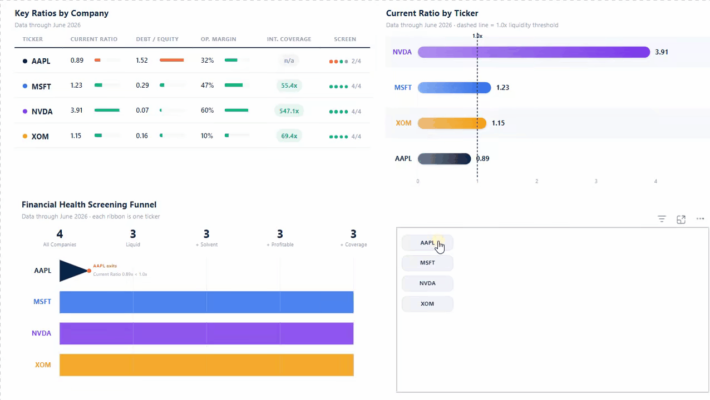
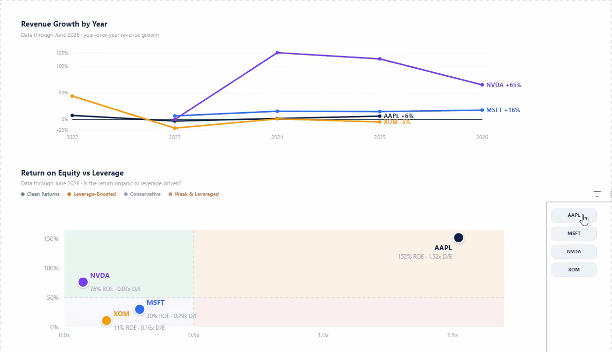

# Financial Health Screening Funnel

## Executive Summary

Northbridge Capital's research desk needed a fast, repeatable way to narrow a watchlist down to fundamentally healthy candidates before committing time to deeper due diligence. This dashboard pulls live financial statement data via API, computes four standard health ratios, funnels a four-company watchlist through liquidity, solvency, profitability, and debt-coverage thresholds, and — on a second page — asks whether the returns behind those ratios are actually earned or just leverage-boosted.

## Business Problem

A profitable company isn't automatically a healthy one — strong margins can mask a fragile balance sheet. Before spending analyst hours on deep-dive due diligence, Northbridge's desk wanted a quick screen answering:

- Which companies in the watchlist clear baseline liquidity and solvency thresholds?
- Where does a company that looks strong on one metric (say, margin) quietly fail on another (say, short-term liquidity)?
- Starting from four companies, how many survive a full health screen?
- For the ones that do look healthy, is the return actually earned, or is it inflated by leverage?

## Data Source

Income statement and balance sheet data for AAPL, MSFT, NVDA, and XOM — up to five most recent fiscal years available per ticker — pulled live from the [Financial Modeling Prep API](https://financialmodelingprep.com) (free tier). ASML was excluded — FMP's free tier restricts fundamentals data to U.S.-domiciled companies, and ASML (Netherlands) falls outside that coverage.

## Methodology

Unlike the SQL-based Investment Portfolio Tracker, this project ingests data directly from a live API — full DAX and endpoint documentation in [`measures.dax`](./measures.dax). A few decisions worth calling out:

**Live API ingestion via Power Query, not a database layer.** Power BI's native Web connector pulls JSON straight from FMP into Power Query, which auto-expands it into a table. Eight calls (income statement + balance sheet × 4 tickers) are combined into two unified tables — `IncomeStatements_All` and `BalanceSheets_All` — using Append Queries, the Power Query equivalent of a SQL `UNION ALL`.

**A many-to-many relationship connects the two statement tables.** Both tables carry multiple fiscal years per ticker, so neither side is unique — the relationship is set to many-to-many on `symbol`, which lets a single visual pull ratios computed from *both* the income statement and balance sheet at once.

**Fiscal-year handling via `ALLEXCEPT`.** Apple's fiscal year ends in September, Microsoft's in June — every ratio measure scopes to each ticker's own latest reported year rather than assuming a shared calendar year, the same pattern used for `Total Return` in the Investment Portfolio Tracker.

**The funnel counts survivors, not company names.** Each stage is a DAX measure that counts how many tickers still satisfy every threshold up to that point (`FILTER` + `COUNTROWS` over `VALUES(symbol)`), so the funnel narrows as thresholds stack: Current Ratio ≥ 1 → also Debt-to-Equity ≤ 1 → also Operating Margin > 0 → also Interest Coverage ≥ 3x.

**Tables and charts are rendered as DAX-generated HTML/SVG, not native visuals.** Every "designed" visual — the ratios table, the bar chart, the 5-stage funnel, and both page-2 charts — is a single DAX measure that returns a complete HTML/SVG string, bound to an HTML Content custom visual. This gives full control over typography, per-ticker accent colors, gradients, and conditional formatting that native visuals can't match — at the cost of the visual being read-only, so every one of them reacts to the ticker filter by dimming (not hiding) non-selected tickers, computed defensively with `ALL()` so the underlying numbers never break under an active filter.

**The 5-stage funnel preserves company identity instead of collapsing to a count.** Rather than an anonymous "4 → 3 → 3 → 3 → 3" bar funnel, each ticker is a fixed-color ribbon that flows left to right through the five stages and visibly tapers off — labeled with the exact metric and threshold it missed — at the stage it stops qualifying.

**Interactive ticker filter built in Deneb (Vega-Lite), not a native slicer.** A custom clickable "pill" filter drives real cross-filtering on both pages through Power BI's native interactivity. Getting the pill's own selected-state styling to survive Power BI's re-render on every click required reading Deneb's `__selected__` field instead of the Vega-Lite selection param directly — the param resets on every cross-filter round-trip, `__selected__` doesn't.

## Dashboard

### Page 1 — Financial Health Screening

- **Key Ratios by Company** — Current Ratio, Debt-to-Equity, Operating Margin, and Interest Coverage per ticker, each with a mini progress bar against its own screening threshold and a 4-dot pass/fail summary
- **Current Ratio by Ticker** — gradient bar chart with a dashed reference line at 1.0, the liquidity threshold
- **Financial Health Screening Funnel** — identity-preserving ribbon funnel: each ticker's own color flows through the five stages and tapers off exactly where it fails
- **Ticker filter** — click a ticker to cross-filter the whole page

### Page 2 — Profitability & Return Quality

- **Revenue Growth by Year** — year-over-year revenue growth per ticker across all available fiscal years, each line directly labeled at its end
- **Return on Equity vs Leverage** — ROE plotted against Debt-to-Equity in four labeled quadrants, to make explicit whether a high return is organic or leverage-driven

## Key Insights

- **AAPL is the only company the funnel filters out — and it fails at the very first stage.** Its Current Ratio (0.89) sits just under the 1.0 liquidity threshold, despite AAPL posting the second-highest Operating Margin in the group (32%). Profitability alone didn't clear it through the screen.
- **NVDA is healthy across every single metric, not just one.** Highest Current Ratio (3.91), lowest Debt-to-Equity (0.07), highest Operating Margin (60%), and an Interest Coverage of 547x — a balance sheet with essentially no leverage-driven risk.
- **XOM has the thinnest margin of the four (10%)** — consistent with the energy sector's typically tighter cost structure versus tech peers — but still clears every liquidity, solvency, and coverage threshold comfortably.
- **AAPL's Interest Coverage is blank, not broken.** Its two most recent annual filings report $0 interest expense, so the ratio is undefined rather than zero — noted here rather than forced into a misleading number.
- **AAPL has the highest ROE in the group (152%) — but it's the most leverage-boosted, not the most efficient.** Its Debt-to-Equity (1.52, the highest of the four) and years of share buybacks shrinking book equity inflate the ratio; NVDA earns a comparable 76% ROE with essentially no leverage (0.07 D/E) — the "clean" version of the same result.
- **NVDA's revenue grew 126% in a single year (FY2024)** — more than 7x the next-fastest grower (XOM, +44% in its own strongest year) — while AAPL and MSFT compounded in the high single to low double digits over the same period, the far more typical pattern for an established mega-cap.
- **XOM's return profile is the mirror image of AAPL's: modest (11% ROE) but genuinely conservative (0.16 D/E)** — the energy sector's tighter margins showing up as an honest, unlevered return rather than a red flag.

## Limitations & Next Steps

- Limited to four companies; ASML was dropped due to a data-source restriction, not a deliberate exclusion.
- Thresholds (Current Ratio ≥ 1, Debt-to-Equity ≤ 1, Interest Coverage ≥ 3x) are conventional screening defaults, not sector-tuned — a real screen would flex these by industry (e.g., utilities typically run higher leverage than tech).
- The funnel itself is still a single point-in-time snapshot (latest fiscal year only); page 2's multi-year revenue trend is a first step toward trend-awareness, but the *screening* thresholds aren't yet evaluated historically — a company passing today could have failed two years ago.
- Next step, already planned: apply this same funnel methodology to the IBEX 35, testing whether the same thresholds hold up outside the U.S. tech-heavy sample used here.

## Design & Tooling Note

All analytical DAX in this model — every ratio measure, the fiscal-year-safe patterns, the funnel's threshold logic, and the ROE/leverage measures — is original work. Claude Code was used only for the visual design layer: connected live to this Power BI file through the Power BI Modeling MCP server, it wrote and validated the DAX that renders each "designed" visual as HTML/SVG, plus the Deneb (Vega-Lite) spec behind the ticker filter. Placing, sizing, and binding every visual on the report canvas — which the MCP connection cannot reach — was done by hand.

## Tools Used

Power BI Desktop · Power Query (Web/JSON connector) · DAX · Financial Modeling Prep API · Deneb (Vega-Lite) · HTML Content custom visual · Claude Code · Power BI Modeling MCP server · GitHub
