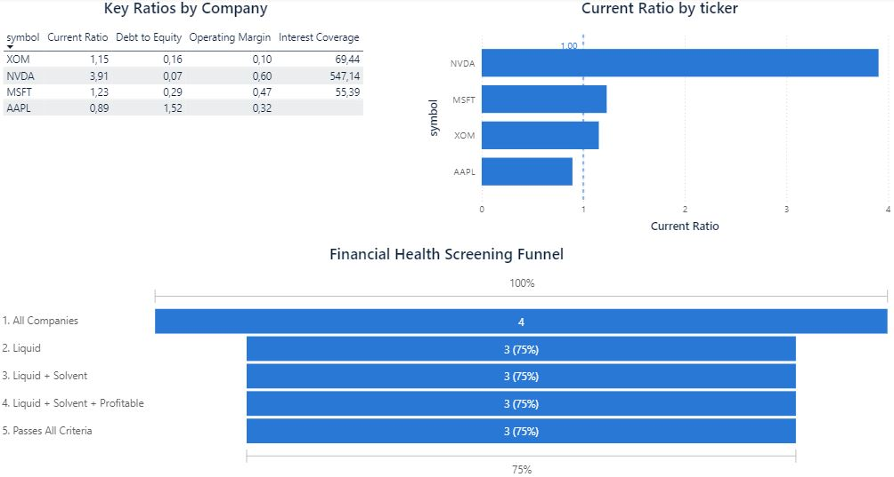

# Financial Health Screening Funnel

## Executive Summary

Northbridge Capital's research desk needed a fast, repeatable way to narrow a watchlist down to fundamentally healthy candidates before committing time to deeper due diligence. This dashboard pulls live financial statement data via API, computes four standard health ratios, and funnels a four-company watchlist through liquidity, solvency, profitability, and debt-coverage thresholds.

## Business Problem

A profitable company isn't automatically a healthy one — strong margins can mask a fragile balance sheet. Before spending analyst hours on deep-dive due diligence, Northbridge's desk wanted a quick screen answering:

- Which companies in the watchlist clear baseline liquidity and solvency thresholds?
- Where does a company that looks strong on one metric (say, margin) quietly fail on another (say, short-term liquidity)?
- Starting from four companies, how many survive a full health screen?

## Data Source

Income statement and balance sheet data for AAPL, MSFT, NVDA, and XOM, most recent fiscal year available, pulled live from the [Financial Modeling Prep API](https://financialmodelingprep.com) (free tier). ASML was excluded — FMP's free tier restricts fundamentals data to U.S.-domiciled companies, and ASML (Netherlands) falls outside that coverage.

## Methodology

Unlike the SQL-based Investment Portfolio Tracker, this project ingests data directly from a live API — full DAX and endpoint documentation in [`measures.dax`](./measures.dax). A few decisions worth calling out:

**Live API ingestion via Power Query, not a database layer.** Power BI's native Web connector pulls JSON straight from FMP into Power Query, which auto-expands it into a table. Eight calls (income statement + balance sheet × 4 tickers) are combined into two unified tables — `IncomeStatements_All` and `BalanceSheets_All` — using Append Queries, the Power Query equivalent of a SQL `UNION ALL`.

**A many-to-many relationship connects the two statement tables.** Both tables carry multiple fiscal years per ticker, so neither side is unique — the relationship is set to many-to-many on `symbol`, which lets a single visual pull ratios computed from *both* the income statement and balance sheet at once.

**Fiscal-year handling via `ALLEXCEPT`.** Apple's fiscal year ends in September, Microsoft's in June — every ratio measure scopes to each ticker's own latest reported year rather than assuming a shared calendar year, the same pattern used for `Total Return` in the Investment Portfolio Tracker.

**The funnel counts survivors, not company names.** Each stage is a DAX measure that counts how many tickers still satisfy every threshold up to that point (`FILTER` + `COUNTROWS` over `VALUES(symbol)`), so the funnel narrows as thresholds stack: Current Ratio ≥ 1 → also Debt-to-Equity ≤ 1 → also Operating Margin > 0 → also Interest Coverage ≥ 3x.

## Dashboard

- **Key Ratios by Company** — Current Ratio, Debt-to-Equity, Operating Margin, and Interest Coverage per ticker
- **Current Ratio by ticker** — with a reference line at 1.0, the liquidity threshold
- **Financial Health Screening Funnel** — how many of the four companies survive each successive filter

## Key Insights

- **AAPL is the only company the funnel filters out — and it fails at the very first stage.** Its Current Ratio (0.89) sits just under the 1.0 liquidity threshold, despite AAPL posting the second-highest Operating Margin in the group (32%). Profitability alone didn't clear it through the screen.
- **NVDA is healthy across every single metric, not just one.** Highest Current Ratio (3.91), lowest Debt-to-Equity (0.07), highest Operating Margin (60%), and an Interest Coverage of 547x — a balance sheet with essentially no leverage-driven risk.
- **XOM has the thinnest margin of the four (10%)** — consistent with the energy sector's typically tighter cost structure versus tech peers — but still clears every liquidity, solvency, and coverage threshold comfortably.
- **AAPL's Interest Coverage is blank, not broken.** Its two most recent annual filings report $0 interest expense, so the ratio is undefined rather than zero — noted here rather than forced into a misleading number.

## Limitations & Next Steps

- Limited to four companies; ASML was dropped due to a data-source restriction, not a deliberate exclusion.
- Reflects a single point-in-time snapshot (latest fiscal year only) rather than a trend — a company passing today could have failed two years ago.
- Thresholds (Current Ratio ≥ 1, Debt-to-Equity ≤ 1, Interest Coverage ≥ 3x) are conventional screening defaults, not sector-tuned — a real screen would flex these by industry (e.g., utilities typically run higher leverage than tech).
- Next step, already planned: apply this same funnel methodology to the IBEX 35, testing whether the same thresholds hold up outside the U.S. tech-heavy sample used here.

## Tools Used

Power BI Desktop · Power Query (Web/JSON connector) · DAX · Financial Modeling Prep API · GitHub

## Self-Grade

- [x] **Business relevance** — answers a real pre-due-diligence screening question, not just a ratio dump
- [x] **Analytical rigor** — fiscal-year-aware measures and a genuine multi-stage funnel, not a single static table
- [x] **Professional polish** — consistent theme with the Investment Portfolio Tracker, reference line tied directly to the funnel's own threshold, verified numbers across visuals
